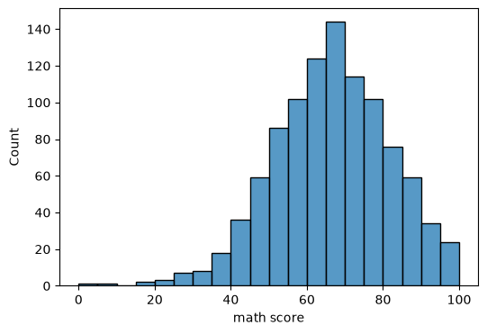
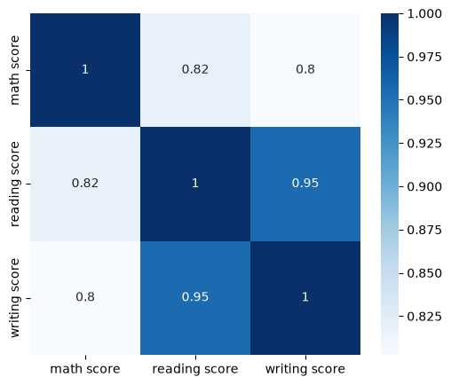
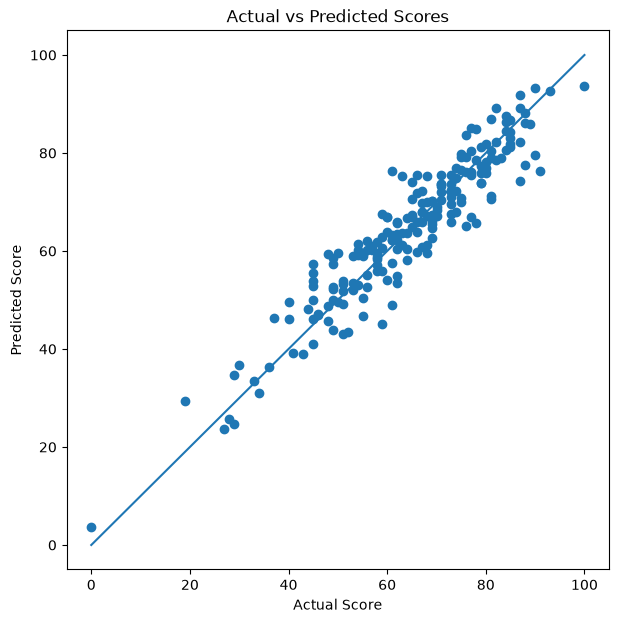

# 🎓 Student Performance Prediction


---

## 📌 Project Overview

This project predicts **students' math scores** based on demographic and academic features using **Linear Regression**.

It demonstrates a complete Machine Learning workflow including data exploration, preprocessing, feature engineering, model training, prediction, and performance evaluation.

This project is part of my **Artificial Intelligence learning journey**, where I build practical AI projects while studying Machine Learning, Deep Learning, NLP, Computer Vision, LLMs, and Generative AI.

---

# 🚀 Features

- 📂 Data Loading
- 🧹 Data Cleaning
- 📊 Exploratory Data Analysis (EDA)
- 📈 Data Visualization
- ⚙️ Feature Encoding
- 🔀 Train/Test Split
- 🤖 Linear Regression
- 📉 Model Evaluation
- 🎯 Prediction Analysis

---

# 🛠️ Technologies

- Python
- Pandas
- NumPy
- Matplotlib
- Seaborn
- Scikit-learn
- Jupyter Notebook

---

# 📂 Project Structure

```text
Student-Performance-Prediction/
│
├── data/
│   └── StudentsPerformance.csv
│
├── notebooks/
│   └── Student_Performance_Prediction.ipynb
│
├── images/
│   ├── math_score_distribution.png
│   ├── correlation_heatmap.png
│   └── actual_vs_predicted.png
│
├── README.md
├── requirements.txt
└── .gitignore
```

---

# 📊 Dataset

The project uses the **Students Performance Dataset**, containing information about:

- Gender
- Race / Ethnicity
- Parental Level of Education
- Lunch Type
- Test Preparation Course
- Math Score
- Reading Score
- Writing Score

---

# 🔄 Machine Learning Workflow

- Data Loading
- Data Exploration
- Exploratory Data Analysis (EDA)
- Data Preprocessing
- Feature Engineering
- Feature Encoding
- Train/Test Split
- Linear Regression
- Model Training
- Model Evaluation
- Prediction

---

# 📷 Project Visualizations

## 📈 Distribution of Math Scores



---

## 🔥 Correlation Heatmap



---

## 🎯 Actual vs Predicted Scores



---

# 📈 Model Performance

| Metric | Score |
|---------|------:|
| RMSE | **5.39** |
| R² Score | **0.8804** |

### Interpretation

- The model achieved an **RMSE of 5.39**, indicating a relatively low prediction error.
- The **R² Score of 0.8804** shows that the model explains approximately **88%** of the variance in students' math scores.
- These results demonstrate that Linear Regression provides a strong baseline model for this prediction task.

---

# 💡 Future Improvements

As I continue learning Artificial Intelligence, I plan to enhance this project by experimenting with:

- Decision Tree Regression
- Random Forest Regression
- XGBoost
- Feature Selection
- Hyperparameter Tuning
- Cross Validation
- Deep Learning Models

---


# ▶️ Getting Started

## Clone the repository

```bash
git clone https://github.com/Ai-MAFlutter/Student-Performance-Prediction.git
```

## Install dependencies

```bash
pip install -r requirements.txt
```

## Launch Jupyter Notebook

```bash
jupyter notebook
```

Open:

```
notebooks/Student_Performance_Prediction.ipynb
```

Run all notebook cells.

---

# 👩‍💻 Author

## Marina Wahid

**AI Student | Flutter Developer | Python Developer**

🔗 GitHub: https://github.com/Ai-MAFlutter

---

## ⭐ Support

If you found this project helpful, consider giving it a ⭐ on GitHub.